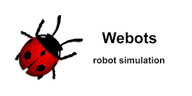
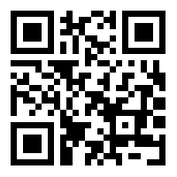
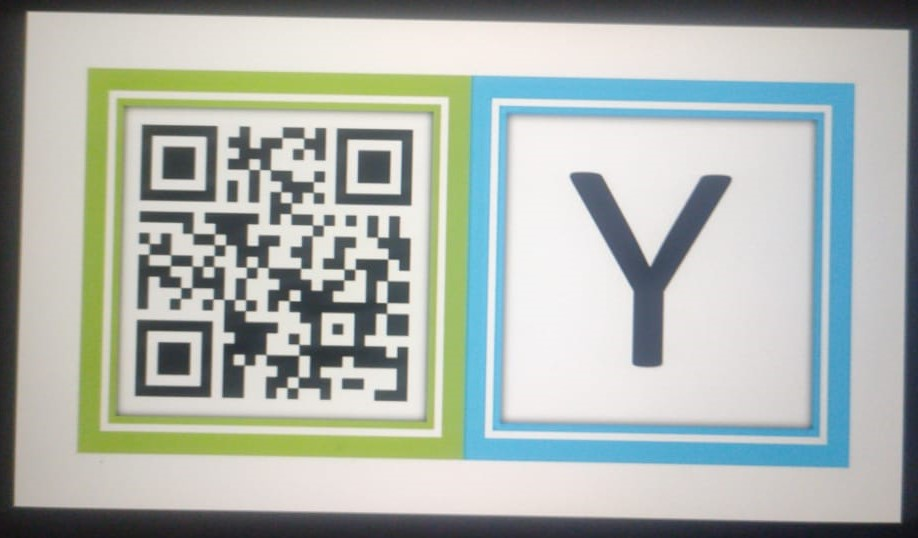
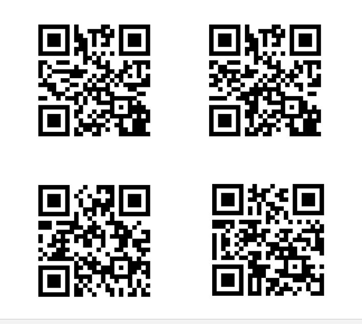
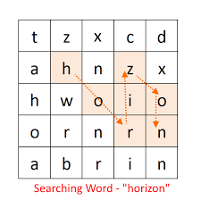
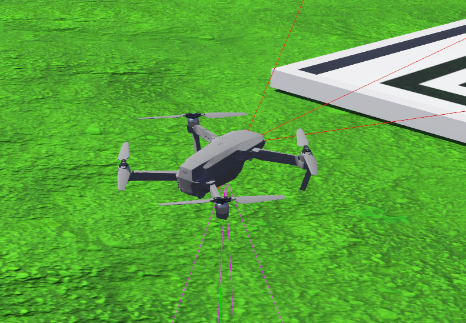
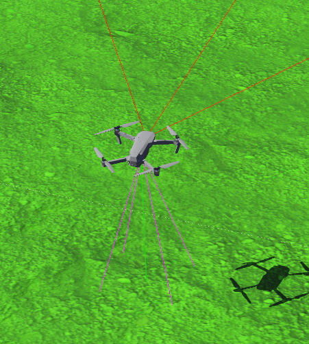

# Technex'21 (AUTONOMOUS DRONE EVENT)
## Event Detail
In the autonomous event we are using Webots simulation.

To visit Webots offical site [click here](https://cyberbotics.com/)

## Installation instructions
###   Webots installation
- Download Webots installation file from the links given below:
  - [Windows](https://github.com/cyberbotics/webots/releases/download/R2021a/webots-R2021a_setup.exe)
  - [macOS](https://github.com/cyberbotics/webots/releases/download/R2021a/webots-R2021a.dmg)
  - [linux (Ubuntu 20.04)](https://github.com/cyberbotics/webots/releases/download/R2021a/webots-R2021a-x86-64.tar.bz2)
  
  (For other versions of operating system visit Webots official site.)

### Python requirement
-  Teams are supposed to use default python version in their OS.
-  Modules and Libraries which they want to use should be installed on their default python.

### World setup

Just clone this git repo and extract the task.zip file.

There will be a world file (.wbt) in this zip file . Teams have to open this world file in Webots and work on it.

>NOTE:- For any doubts regarding any of the above instruction refer [this link](https://cyberbotics.com/doc/guide/index)

## Task for the event

- Teams are supposed to scan images that are on the ground. There will be three type of images .

  - First one will contain only a QR-code, which contains position coordinate i.e. x and y position, of next image that will be on a building.
    
  - After that 9 different images will be there on top of each building, each image on the building will have two sections:
    - QR code containing the coordinate of next image.
    - An english alphabet letter.
  
  - Last image will contain 4 QR-codes and teams have to land their drones on one of them.
  

>NOTE:- Images may not be placed in proper orientation team have to make them useable.

 - Teams are supposed to make an 3 X 3 matrix from the 9 alphabets they get from images in the same order as they reach the character.
 
 - After scanning and detecting all 9 alphabets teams have to make all possible 4 letter words according to word search algorithm.
 
 - QR codes in the last position will contain a word that is generated from the matrix above and it also contain a position where drone is to be landed. 
 
## Drone Specifications:
- We are using `Dji Mavic 2 pro`, which have a downward facing camera to take images.

- Also drone have 4 distance sensors (for collision avoidance with buildings), 3 in horizontal direction pointing towards drone front side and 1 vertical pointing toward ground.

- We have provided basic code with some function and a basic but not perfect control system from drone . Teams could either use these or use their own code. (The provided code is basically for your understanding about how to code in controller).

## Submission instruction
- Teams have to submit youtube link of their simulation along with complete screen using some screen recorder tools. NOTE:- don't use inbuild recorder of Webots.
- Youtube video must be unlisted and should have title as the team name and team leader name respectively.
- Teams also have to submit their controller code. NOTE:- Avoid hardcoding. 
- Submissions will be on AMC official [webpage](https://forms.gle/4rLceiFoksNxGdtN6).     
   
